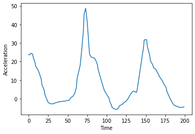
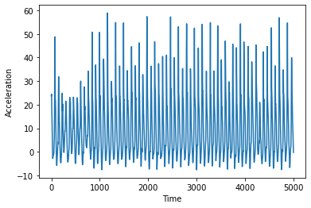
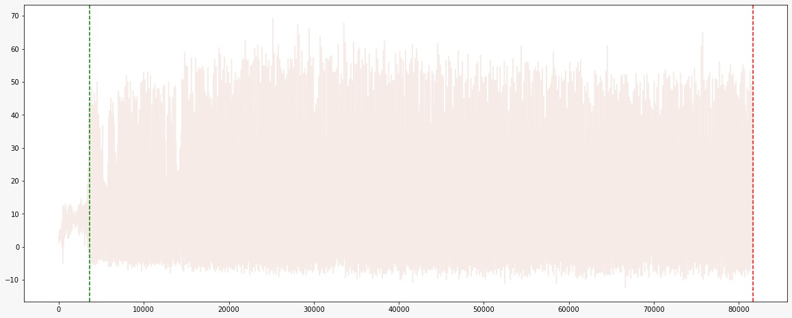
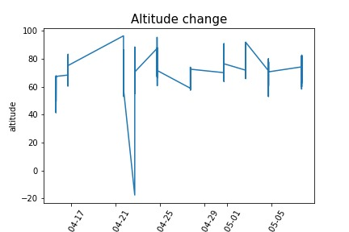
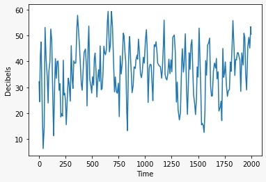
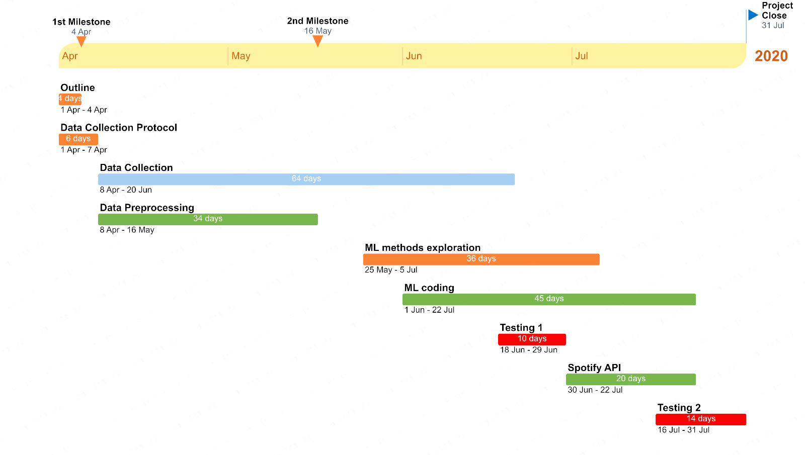

Research Title
----------
Methods for improving Prof Brutti's run sessions


----------


Abstract
----------

The main aim of this project is to provide runners with a suitable playlist for their day to day training, which can match the beat of each runner's pace with the beat of their favourite songs. We will mainly focus our attention on the use of interpretable machine learning algorithms to predict the near future pace a runner will have. With respect to the data collection task, we will be collecting our own training session data through a variety of mobile phone applications and potentially fitness tracking devices.


----------


Project Update
----------

We will enumerate the project updates below:

\begin{enumerate}
\item The most relevant update regarding the project is that we have recently decided not to use the \textit{steps} data provided by Google Fit. The rational behind this decision is that this information was only available for large intervals of time ($\sim$ 1 min), meaning we would lose granularity on the Arduino data if we were to merge them. Instead we will only use Google Fit data to extract information on Altitude and Distance, which is provided in a much more granular fashion (order of milliseconds as the Arduino data).
\item The merge between Arduino and Google fit will be performed by fixing the Arduino data timestamps, and imputing Google Data by performing a linear interpolation (linear interpolation will also be used to replace missing data in the Arduino measurements).
\item Among the difficulties we are facing in the data collection process we can highlight that for some of the users the Arduino App stops recording data abruptly after some random time. We are currently still trying to fix this by using other apps that might allow us to keep the phone active during our running session (e.g. Wakey). In the worst case scenario we will use the incomplete data. However, for two of the runners the Arduino App is able to collect data from start to end of the sessions.
\item We currently have around 10 running sessions for each user. The features that we are collecting are all those available in Arduino and the features Altitude and Distance from Google Fit.
\item All the raw data we have collected up to this point can be found under the following link: \href{https://drive.google.com/drive/u/1/folders/1mLCIF9zQHs7qVXGG03_Cj18c8y0vQie2}{Data Storage}.
\item A small sample of the already pre-processed and merged data sets can be found below. A larger sample of this data (already pre-processed) can also be found in the csv file delivered in the Milestone 2.
\end{enumerate}

```{r echo=FALSE}
library(knitr)
library(kableExtra)

df = read.csv("./data/preprocessed/preprocessed_run_9.csv")
colnames(df)[3] <- "LinAcc"
caption <- "Example of the already pre-processed and merged data. 
            In order to provide some additional information regarding the sampling frequency,
            the rows are shown by steps of 100."
df[seq(from=2000, to=2900, by=100),] %>% kable("latex", booktabs=T,
                   caption=caption,
                   table.envir = "table", position = "!h",
                   row.names=NA) %>% kable_styling(font_size = 9)
```

Finally, we will also present some illustrative plots on the current data:
 
 
 
 

 
 
  
 
  


\newpage


----------

Updated Project Timeline
----------



The data pre-processing phase of the project is already complete, and we foresee to start working on the modeling part after the 25 of May. The next sections of this report have not changed since the last Milestone.

----------


Main research aim \& framework
----------

The main aim of this project is to provide runners with a suitable playlist for their day to day training. There are a wide range of papers that have shown that music has a very large impact on the performance of a runner (<a href="#3">[3]</a>). There are however fewer papers and apps that actively try to use music to improve the runner's pace/cadence. Between these few apps and papers we can highlight: <a href="#4">[4]</a> and [Weav Run](https://run.weav.io/). The main goal can therefore be decomposed into two smaller prediction goals:

\begin{itemize}
\item Predict the running pace/cadence of each individual based on their past training sessions and some additional features (e.g. audio, heart beat, linear acceleration, steps, altitude, etc.).
\item Play songs that can match the current and possibly future cadence of the runner so that the runner can stay motivated at all times.
\end{itemize}

Secondary goals that can also be considered depending on the time and intermediate issues that may appear on the way:

\begin{itemize}
\item Can we also apply this to other activities (cycling, walking, boxing, etc.)?
\item Besides the song’s beat, can we also see what type of music suits runners best and therefore recommend other songs that are not in the playlist to the user?
\end{itemize}

----------

IML paper(s) you like (at this point!) (review)
----------

According to the article <a href="#10">[10]</a>, there are three levels of interpretability:
\begin{itemize}
\item Statistical interpretability, which aims to uncover statistical associations to assess how seeing x would change our belief in y
\item Causal interventional interpretability, which is designed to define how a change in x could affect y
\item Counterfactual interpretability, which intends to explain why x affects y.
\end{itemize}

Speaking in terms of "final goal", our work will mainly be focused on the statistical level. However, since we want to keep our model as simple and understandable as possible, it will be necessary to investigate which of the features (x) are actually relevant for the prediction (y) and which are not.

Despite our final goal being to look for interpretability at statistical level, we also found some of the papers on counterfactual level interesting (also known as post-hoc interpretability as defined in <a href="#5">[5]</a>): The paper <a href="#8">[8]</a> uncovers more complex models by finding the nearest counterfactual explanation by minimizing the following expression relying on SMT techniques:

\begin{align}
\hat{\boldsymbol{x}}^* \in \operatorname*{argmin}_{\boldsymbol{x} \in CF_f(\hat{\boldsymbol{x}})} d(\boldsymbol{x}, \hat{\boldsymbol{x}})
\end{align}

where $CF_f(\hat{\boldsymbol{x}})$ contains all the inputs x for which the model $f$ returns a prediction different from $f(\hat{\boldsymbol{x}})$ (so basically we are fixing $\hat{\boldsymbol{x}}$ and also $f$, and we look for all of the input feature vectors that live in $X$ such that the predictions are different) and $d$ is any appropriate distance measure between the feature vectors $\hat{\boldsymbol{x}}$ and $\boldsymbol{x}$.

As a last remark though, and quoting from the paper of Rudin <a href="#11">[11]</a> we will initially try to build our machine learning model in such a way that it is as interpretable as possible, without needing any additional explainable model that interprets the results. 

-------

Data source(s) 
----------

We aim to make use of the [Arduino Science Journal app](https://play.google.com/store/apps/details?id=cc.arduino.sciencejournal&hl=en), running on four different models of Android smartphones in order to collect the accelerometer and other sensors' measurements recorded during a running session. Furthermore, we plan to exploit the functionalities of fitness and sports apps; at this stage of the project development, we selected the [Google Fit](https://play.google.com/store/apps/details?id=com.google.android.apps.fitness&hl=en) app, which provides information regarding the steps' count, the distance, the speed, the altitude and other derived variables in a structured file format. Nevertheless, additional software may be required to expand the feature set. Finally, we reckon that just our smartphones and, maybe, a couple of wearable devices will be needed. For the music recommender module, we will rely on the Spotify REST API and other web services, e.g. [Music Database, University of British Columbia](https://www.cs.ubc.ca/~davet/music/index.html).


----------

Data collection
----------

The data will be recorded during at least 20 running sessions throughout the entire project development (see the project schedule in the section below); each session will be carried out individually for about 30 minutes, making use of the aforementioned software and hardware tools; at the end of the collection, we aim to have four individual data sets - one for each group member -, that will be handled independently from each other. These raw measurements are expected to require order of hundreds of Megabytes or few Gigabytes storage. Dealing with general purpose sensors and commercial applications and since the records will be captured outdoor, in potentially unpredictable environments, noise removal will be particularly challenging.


----------

Model \& Methods
----------

We would like to implement some multivariate time series models, as we feel that our data will be best analysed when interpreted as a time series. Each run would be added on to the global time series, so that in the end a model would be created for each individual runner.

Given that we will work with time series data, before starting to do any predictions we will first need to do some additional data exploration and pre-processing:

\begin{itemize}
\item \textbf{Seasonal variations:} Which in this case would take the form of a pattern identifiable within each single run (for example, a slower start and end of the run, compared to the pace in the middle of it)
\item \textbf{Secular trend:} Which would identify any improvement of performance of the runner over time
\item \textbf{Irregular variations and cyclical fluctuations:} Which are to be ignored
\item \textbf{Time series smoothing:} Required given the high volatility of time series data. Some techniques that we will be inspecting are moving average smoothing, exponential smoothing, etc.
\end{itemize}

Once the time series have been processed properly, some models that will initially be investigated are the following:

\paragraph{ARIMA}

The ARIMA is a class of models that ‘explains’ a given time series based on its own past values, so that equation can be used to forecast future values. ARIMA results from the combination of three procedures: Autoregression, integration and Moving Averages. It can be represented by the equation:

\begin{align}
I^i_t = \delta + \sum_{i=1}^p \phi_i I_{t-1}^{'} + \sum_{i=1}^q \theta_i e_{t-1}+e_t
\end{align}

where *p* is the order of the AR term, *q* is the order of the MA terms and *I* depends on the number of differentiating required to make the time series stationary.

ARIMA can model homogeneous non-stationary series, like time series with a non-explosive trend, however if the data presents seasonality patterns the series may also have autocorrelation for a seasonal station s. In this context we can use the seasonal ARIMA models, also known as SARIMA. 

\paragraph{ARIMAX}

The ARIMAX model is an extension of the previous one, in the sense that it adds an exogenous variable (so an external one) to help in measuring the endogenous variable of interest. For this reason, the related formula is also very similar to the one of ARIMA: only X and its coefficient $\beta$ have to be added to the previous equation


\paragraph{VAR}

The VAR (Vector Autoregression) model is another statistical model and it has proven to be particularly suitable for analyzing multivariate time series that influence each other. Aiming to describe the evolution of $k$ variables over time, its power lies on the inclusion of *lags*, i.e. it takes into account the values of the variables in the previous time period. Depending on the number of *lags*, say $p$, the $p$-th order VAR model is expressed as:

$$
y_t = c + \sum_{i=1}^{p} A_i y_{t-i} + e_t
$$

having $y_{t-i}$ the $i$-th lag, $c$ a vector of constants, $A_i$ a time-invariant matrix and $e_t$ a vector of errors related to the current $t$ time series.


In order to find the best performing model between these for each individual, we will rely on some sample splitting methods in order to make our model selection more robust on new data (e.g. k-fold CV, LOOCV).

There has been a lot of research in recent years in the field of interpretable machine learning for multivariate time series forecasting since most state-of-the-art models involved in this activity are deep learning models which ultimately act as black boxes. Some of the papers that try to tackle these issues are <a href="#2">[2]</a>, <a href="#6">[6]</a>. If we are not able to get satisfactory results with more interpretable models and have to leverage on black box models, interpreting them using the techniques described in the previous papers could be a good idea.

----------


Software/Hardware Toolkit
----------

We are going to use pandas for any preprocessing that may be needed, and proceed with python for the actual coding. Based on the models we will employ, we are going to work with their appropriate packages.

For the music part of it, we are going to work with [Spotipy](https://spotipy.readthedocs.io/en/2.17.1/), a Python library for the Spotify Web API.
Finally, for the data collection, we are going to make use of the above mentioned mobile apps.


----------


References
----------

- <span id="1">[1]</span> Bäärnhielm, A. (2017). *Multiple time-series forecasting on mobile network data using an RNN-RBM model*.
- <span id="2">[2]</span> Barbieri, S., Kemp, J., Perez-Concha, O. et al. *Benchmarking Deep Learning Architectures for Predicting Readmission to the ICU and Describing Patients-at-Risk.* Sci Rep 10, 1111 (2020). https://doi.org/10.1038/s41598-020-58053-z
- <span id="3">[3]</span> Bly, Kristopher, *The effect of music playlist tempo on self-paced running, mood, and attentional focus tendencies* (2013), Ithaca College Theses. 12. https://digitalcommons.ithaca.edu/ic_theses/12
- <span id="4">[4]</span> Buhmann J, Moens B, Van Dyck E, Dotov D, Leman M (2018) *Optimizing beat synchronized running to music*. PLoS ONE 13(12): e0208702. https://doi.org/10.1371/journal.pone.0208702
- <span id="5">[5]</span> Laugel, Thibault & Lesot, Marie & Marsala, Christophe & Renard, Xavier & Detyniecki, Marcin. (2017). *Inverse Classification for Comparison-based Interpretability in Machine Learning*.
- <span id="6">[6]</span> L. Pantiskas, K. Verstoep and H. Bal, *"Interpretable Multivariate Time Series Forecasting with Temporal Attention Convolutional Neural Networks,"* 2020 IEEE Symposium Series on Computational Intelligence (SSCI), Canberra, ACT, Australia, 2020, pp. 1687-1694, doi: 10.1109/SSCI47803.2020.9308570.
- <span id="7">[7]</span> Katardjiev, N. (2018). *High-variance multivariate time series forecasting using machine learning (Dissertation)*. Retrieved from http://urn.kb.se/resolve?urn=urn:nbn:se:uu:diva-353827
- <span id="8">[8]</span> Karimi, A., Barthe, G., Balle, B. & Valera, I.. (2020). *Model-Agnostic Counterfactual Explanations for Consequential Decisions. Proceedings of the Twenty Third International Conference on Artificial Intelligence and Statistics*, in *Proceedings of Machine Learning Research* 108:895-905 Available from http://proceedings.mlr.press/v108/karimi20a.html
- <span id="9">[9]</span> Parmezan, Antonio. (2019). *Re: What are the best machine learning algorithms for time series forecasting*?. Retrieved from: https://www.researchgate.net/post/What-are-the-best-machine-learning-algorithms-for-time-series-forecasting/5d7e74010f95f1bedb676868/citation/download.
- <span id="10">[10]</span> Raha Moraffah, Mansooreh Karami, Ruocheng Guo, Adrienne Raglin, and Huan Liu. 2020. *Causal Interpretability for Machine Learning - Problems, Methods and Evaluation*. SIGKDD Explor. Newsl. 22, 1 (June 2020), 18–33. DOI:https://doi.org/10.1145/3400051.3400058
- <span id="11">[11]</span> Rudin, C. *Stop explaining black box machine learning models for high stakes decisions and use interpretable models instead*. Nat Mach Intell 1, 206–215 (2019). https://doi.org/10.1038/s42256-019-0048-x
- <span id="12">[12]</span> Wagner, N., Michalewicz, Z., Schellenberg, S., Chiriac, C. and Mohais, A. (2011), *"Intelligent techniques for forecasting multiple time series in real‐world systems"*, International Journal of Intelligent Computing and Cybernetics, Vol. 4 No. 3, pp. 284-310. https://doi.org/10.1108/17563781111159996


----------
