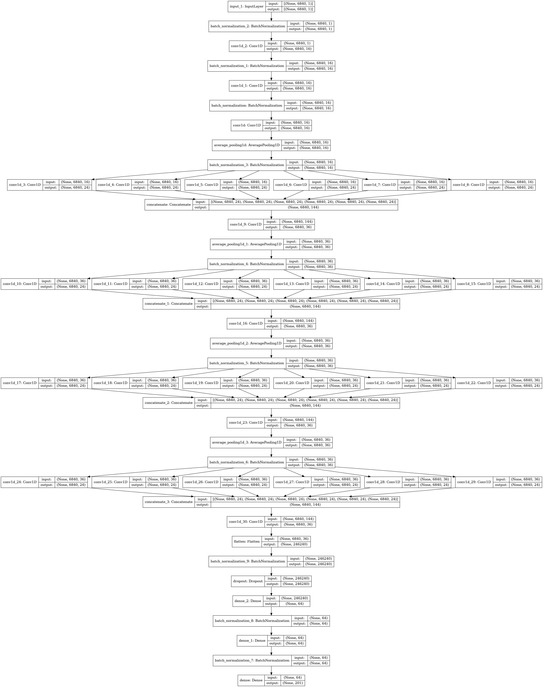

``` {r, Load Libraries, include=FALSE}
library(dplyr) 
library(caret)
library(randomForest)
library(corrplot)
library(Metrics)
library(data.table)
library(keras)
library(tensorflow)
library(tfdatasets)
library(kerasR)
```


# A) Data and Goal

### Data Loading/Pre-processing

Explain how we are going to handle the exercise and our first thoughts regarding the data, the mel-spectrum and the stuff we talked about on last monday. 


``` {r Loading Data, include=FALSE}

df.train <- fread('data/train4final_hw.csv')
df.test <- fread('data/test4final_hw.csv')

```

TODO: comment plot and strategy 


### Build the CNN

Following [Schreiber et al.](https://www.researchgate.net/publication/328028453_A_Single-Step_Approach_to_Musical_Tempo_Estimation_Using_a_Convolutional_Neural_Network) we implemented a Convolutional Neural Network to pre-process and synthesize the mel-spectrum associated to each audio sample. As mentioned before, the mel-spectrum gives us the information regarding the frequencies composing the audio signal at each time interval ($t_i \in \{1,...,171\}$); the underlying idea is apply to this spectrum the same techniques that usually apply to the image processing tasks, in order to extract progressively patterns from the frequencies and finally have as output the predicted tempo and the associated probability distribution. 

In doing so, the data samples flow across many different convolutional layers having different dimensional filters up until the output of the convolutions passes through the dense layers, which are in charge of produce the final prediction. 

Our architecture slightly differs from the one in the reference in the dimension of the input and hence in the dimension of the filters: the mel-spectrum is given us into a flatten form, having the columns of the original matrix chained in a unidimensional vector; for this reason, the number of input nodes reflects the number of mel-features ($40 \times 171$) and all the convolutional filters, which are unidimensional also in the reference paper, are applied only along one axis.

We implemented the CNN by means of the API of the libraries Keras and Tensorflow, relying on the pre-built layers. The model was trained in Google Colab, using the same settings reported in Schreiber et al.

Althought the CNN gives us very good results and a low RMSE, it lacks in interpretability - due also to the great number of parameters - and needs more than 8 epochs (on average) to be trained well. Even if feasible to tackle, these challenges pushed us to decide to early stop the training - the elected model has been trained for 4 (?) epochs - and to make use of the CNN only for a data pre-processing step - synthesize the mel-frequencies spectrum -. Thus, the CNN's predictions were added to the data set as a replacement of the mel-spectrum, leading to a consistent dimensionality reduction.





```{r Functions for CNN, include=FALSE, eval=FALSE}

# Define the multi-filter module
create_mf_module <- function(model, pool_size=2) {
  
  conv_ker_dim <- c(32,64,96,128,196,256)
  mf_mod_first_part <- model %>%
    layer_average_pooling_1d(pool_size = pool_size, 
                             strides = 1, padding = "same") %>%
    layer_batch_normalization()
      
  parallel_layers <- list()
  
  for(size in conv_ker_dim) {
    parallel_layers <- append(parallel_layers, 
                              layer_conv_1d(mf_mod_first_part, filters = 24, 
                                            kernel_size = size, padding = "same",
                                            strides = 1, activation = "elu"))
  }
  
  mf_mod <- layer_concatenate(parallel_layers) %>%
    layer_conv_1d(filters = 36, kernel_size = 1, strides = 1,
                  padding = "same", activation = "elu")
  return(mf_mod)
} 


build_network <- function() {
  inputs <- layer_input(shape = c(40*171, 1))
  # Check the inputs
  summary(inputs)
  
  # Build the network: first 3 layers
  # The number of filters indicates that 16 different filters will be applied at this 
  # step and then the output of this layer will be 16 vectors of shape (1,6840) for each 
  # observation
  outputs <- inputs  %>%
    layer_batch_normalization() %>%
    layer_conv_1d(filters = 16, kernel_size = 5, padding = "same",
                  strides = 1L, activation = "elu") %>%
    
    layer_batch_normalization() %>%
    layer_conv_1d(filters = 16, kernel_size = 5, padding = "same",
                  strides = 1L, activation = "elu") %>%

    layer_batch_normalization() %>%
    layer_conv_1d(filters = 16, kernel_size = 5, padding = "same",
                  strides = 1L, activation = "elu") 
  
  # Check the network so far
  summary(outputs)
  # Add multi-filter modules
  filter_sizes <- c(5, rep(2,3))

  for(filter_size in filter_sizes)
    outputs <- create_mf_module(outputs, pool_size = filter_size)


  # Check outputs
  summary(outputs)
  
  # Add final layers to the outputs
  outputs <- outputs %>%
    layer_flatten() %>%
    layer_batch_normalization() %>%
    layer_dropout(rate = 0.5) %>%
    layer_dense(units = 64, activation = "elu") %>%
    layer_batch_normalization() %>%
    layer_dense(units = 64, activation = "elu") %>%
    layer_batch_normalization() %>%
    layer_dense(units = dim(cat_labels)[2], 
                activation = "softmax") 


  # Check again the outputs
  summary(outputs)
  network <- keras_model(inputs = inputs, outputs = outputs, name="audio_net")


  # Check the network
  summary(network)

  # Compile the network -----------------------------------------------------

  network %>% compile(
    optimizer = "adam",
    loss = "categorical_crossentropy",
    metrics = c("accuracy", "mean_squared_error")
  )

  return(network)
}
```


```{r Evaluate the CNN, eval=FALSE}

#TODO: Clean the code up

library(stringr)
cat("File_Name,TrainRMSE,ValRMSE\n", file="results.csv")
list_dir = list.files('/content')

for (file in list_dir[5:length(list_dir)]) {

    str.id = str_sub(file, 8, 10)
    val.idx = as.numeric(unlist(as.vector(log_list[str.id])))

    labels <- data$tempo
    cat_labels <- keras::to_categorical(labels)
    cat_labels = cat_labels[, (min(labels)+1):ncol(cat_labels)]
    seq_ = seq(min(labels), max(labels))
    colnames(cat_labels) <- seq_

    val.labels <- cat_labels[val.idx,]
    val.data <- data[val.idx,1:(40*171)]

    train.labels <- cat_labels[-val.idx,]
    train.data <- data[!val.idx,1:(40*171)]

    print('Loading model...')
    new_model <- load_model_hdf5(file)
    print('Predicting....')
    res.train = new_model %>% keras_predict(as.matrix(train.data))
    res.val = new_model %>% keras_predict(as.matrix(val.data))

    #Train
    print('Computing RMSE....')
    tempo_predicted_train = apply(res.train,1,which.max)+62
    ground_truth_train = rep(NA, length(tempo_predicted_train))
    for (i in 1:length(ground_truth_train)) {
        ground_truth_train[i] = match(c(1), train.labels[i, ])+62
    }
    rmse.train <- sqrt(sum((tempo_predicted_train-ground_truth_train)^2) / length(tempo_predicted_train))

    #Val 
    tempo_predicted_test = apply(res.val,1,which.max)+62
    ground_truth_test = rep(NA, length(tempo_predicted_test))
    for (i in 1:length(ground_truth_test)) {
        ground_truth_test[i] = match(c(1), val.labels[i, ])+62
    }
    rmse.val <- sqrt(sum((tempo_predicted_test-ground_truth_test)^2) / length(tempo_predicted_test))
    print(file)
    print(paste0('Train RMSE: ', rmse.train))
    print(paste0('Val RMSE: ', rmse.val))
    cat(paste0(file, ",", rmse.train, ",", rmse.val, "\n"), file="results.csv",append=TRUE)
    print('====================')
}
```


```{r Generate a new data set, eval=FALSE}

generate_CNN_features <- function(data, model_path) {
  
  df = data[,1:(40*171)]
  
  print('Loading Model')
  new_model <- load_model_hdf5(model_path)
  print('Model Loaded')
  print('Doing Prediction')
  res = new_model %>% keras_predict(as.matrix(df))
  print('Prediction Done, soon done')
  
  target = apply(res,1,which.max)+62
  prob.target = apply(res,1,max)
  
  output = list(target=target, prob.target=prob.target)
  return(output)
}

CNN.train = generate_CNN_features(data.train, '/content/weights312-128.04-0.44.hdf5')
CNN.test = generate_CNN_features(data.test, '/content/weights312-128.04-0.44.hdf5')


```


TODO: show part of the results in the .csv file "results.csv"

Explain the new data set


<!-- End of CNN -->


### Feature Engineering

Explain the steps (how and why)

```{r New data loading, include=FALSE}
df.train <- as.data.frame(fread('data/train4final_hw_CNN.csv'))
df.test <- as.data.frame(fread('data/test4final_hw_CNN.csv'))

df.train <- df.train %>% dplyr::select(-contains(c('mel')))
df.test.red <- df.test %>% dplyr::select(-contains(c('mel')))
n = nrow(df.train)
```


``` {r Utility functions, include=FALSE}

apply_svd <- function(data, n_components, plot=T) {
 
  data.matrix <- as.matrix(data %>% dplyr::select(contains('domfr')))
  svd_result <- svd(data.matrix)
  explained_var <- cumsum(svd_result$d^2/sum(svd_result$d^2))
 
  if(plot)
    plot(explained_var, main="Explained Variance",
         xlab="Number of components", ylab="Variance")
 
  data.reduced <- data.matrix %*% svd_result$v[,1:n_components,drop=FALSE] %*%
    diag((svd_result$d)[1:n_components,drop=FALSE])
 
  colnames(data.reduced) <- sapply(1:n_components, function(i) {paste0('feature_', i)})
 
  data.reduced <- cbind(data.reduced, data %>% dplyr::select(-contains("domfr")))
 
  return(data.reduced)
}


train_rf_model <- function(df, svd_components, train_idx, keep.forest=FALSE) {

  df.svd <- apply_svd(df, n_components=svd_components, plot=F)
 
  df.tr <- df.svd[train_idx, ]
  df.val <- df.svd[!train_idx, ]
 
  df.tr <- df.tr %>% dplyr::select(-c('CNN_Prediction_2',
                                      'CNN_Prediction_Prob_2',
                                      'CNN_Prediction_1',
                                      'CNN_Prediction_Prob_1'))
  df.val <- df.val %>% dplyr::select(-c('CNN_Prediction_2',
                                        'CNN_Prediction_Prob_2',
                                        'CNN_Prediction_1',
                                        'CNN_Prediction_Prob_1'))

  x = as.vector(df.tr %>% dplyr::select(-c('tempo', 'id')))
  y = as.vector(as.data.frame(df.tr)[, 'tempo'])
 
  x.test = as.vector(df.val %>% dplyr::select(-c('tempo', 'id')))
  y.test = as.vector(as.data.frame(df.val)[, 'tempo'])
 
 
 
  model = randomForest(x = x, y = y,
                       xtest = x.test,
                       keep.forest = keep.forest)
 
  rmse_val = rmse(model$test$predicted,
                    y.test)

  return(list('model'=model, 'y.test'=y.test))

}

```


```{r SVD tuning, echo=FALSE, fig.width=10, fig.height=8, fig.align='center'}

simulations = 2
components = 5
sim_matrix = matrix(NA, nrow=components-1, ncol=simulations)

for (sim in 1:simulations) {
 
  ind <- sample(c(TRUE, FALSE), n, replace=TRUE, prob=c(0.7, 0.3))

    for (i in 2:components) {
   
    print(paste0('Number of features in SVD: ', i))
   
    rf_model = train_rf_model(df.train,
                              svd_components = i,
                              train_idx = ind)
     
    rmse_val = rmse(rf_model$model$test$predicted,
                    rf_model$y.test)
   
    print(paste0('RMSE value for basic Random Forest is: ',
                 rmse_val))

    sim_matrix[i-1, sim] = rmse_val
  }
}

cols <- sample(viridis::turbo(100), components)

matplot(2:components, sim_matrix, type="l", lty=1, lwd=3, col=cols,
        xlab="Components", ylab="RMSE", main="RMSE vs number of components")
legend("topright", legend=paste0("sim", 1:simulations), col=cols, lwd=3)

```


```{r Predictions, include=FALSE}
rf_model_final = train_rf_model(df.train,
                                svd_components = 2,
                                train_idx = ind,
                                keep.forest = TRUE)

df.test.red <- df.test %>% dplyr::select(-contains(c('mel')))
df.test.svd <- apply_svd(df.test.red, n_components=2, plot=F)
df.test.svd <- df.test.svd %>% dplyr::select(-c('CNN_Prediction_2',
                                                'CNN_Prediction_Prob_2',
                                                'CNN_Prediction_1',
                                                'CNN_Prediction_Prob_1', 'id'))

tempo.predict <- predict(rf_model_final$model, df.test.svd)

df.test = as.data.frame(df.test)

df.test['Tempo Prediction'] <- tempo.predict
write.csv(df.test, 'final_prediction_test.csv')
```


# B) Predicting with confidence

### 1.

In the following section, we implement the split conformal prediction for regression algorithm to compute confidence intervals for our estimations.

The implementation of this algorithm can be subdivided into five steps, the first of which is to randomly split the provided training set into two equal subsets. We call these subsets D1 and D2 and they act as the training and validating datasets.

```{r}

x = as.vector(df.tr %>% dplyr::select(-c('tempo', 'id')))
n = nrow(x)/2
n_obs = n*2 # size of D1
ind <- sample(1:n_obs, n, replace=F)
# split 50 %

D1 = x[sort(ind),] 
D2 = x[-sort(ind),]

D1_y = y[sort(ind)]
D2_y = y[-sort(ind)]

```

Secondly, we use D1 dataset to train the random forest model and then in the third step, we apply the model to the D2 dataset to obtain the corresponding predictions. Since the variable of interest is known in this dataset, we can evaluate its residuals as the absolute difference between the predicted value and the true one.

```{r}

model = randomForest(x = D1, y = D1_y, xtest = D2)

y_D2_pred = model$predicted
R = abs(D2_y - y_D2_pred)

```

```{r, fig.align='center',fig.width=10,echo=FALSE}

hist(R,main='Absolute risk',col='#f6f6f6',breaks = 50,xlab='Risk')
abline(v=median(R), col="red")
abline(v=quantile(R, probs=.95), col="red", lty=2)
```

From the histogram above we can see how the lowest 50% of residuals are all under 20, while only the top 5% are above 62.

In the fourth step, we compute $d$, which is the value that determines the width of the confidence interval. In order to compute it, it is necessary to firstly sort the residuals in ascending order and then calculate the index of the residual that should be considered. Such index is $k$, obtained with the following formula: $[(n/2 +1)(1-\alpha)]$, where $\alpha$ is the probability that our parameter of interest will actually be included in the interval. In this case, having chosen $\alpha=0.05$ we expect that 95% of the D2_y values are included in the interval.

```{r}

alpha = 0.05
k = (n + 1)*(1-alpha)
d = sort(R)[round(k)]
CI_validation_df = data.frame(matrix(c(D2_y,y_D2_pred - d,y_D2_pred + d),ncol=3))
colnames(CI_validation_df)=c('Y','low_pred','up_pred')
head(CI_validation_df)

```

The table above provides some examples of the actual values of the variable of interest and the corresponding confidence interval. It can be observed how the values do actually fall within the lower and upper bounds.

Lastly, we return the confidence intervals for each value of our validation set and plot them.

```{r echo=FALSE, fig.height=8, fig.width=15}

wrong_pred = which(cbind(CI_validation_df$Y > CI_validation_df$up_pred  | CI_validation_df$Y < CI_validation_df$low_pred))
print(paste('Percentage of predictions that are not included in the CI:',length(wrong_pred)/n))

predictions_y = CI_validation_df$Y
names(predictions_y) = 'NA'
lab = rep('green',length(predictions_y))
lab[wrong_pred] = 'red'
names(predictions_y) = lab

```

The plot below shows the prediction intervals for each data point in the D2 set, along with the true values of the target variable. The true values are green when they fall within the interval and red when they do not. Only 4.92% of the predictions here are inaccurate.

```{r}

ax <- 1:length(predictions_y)
plot(predictions_y, type="p", col=names(predictions_y),cex=0.8,ylim=c(40,230),pch=16,ylab='Y',xlab='Observations')
segments(x0=ax,x1=ax,y0=CI_validation_df$low_pred,y1=CI_validation_df$up_pred,col='#e5e5e5',lwd=0.6,ylim=c(40,230))
points(ax, CI_validation_df$up_pred, type="l", col="gray",lwd=0.1,ylim=c(40,230))
points(ax, CI_validation_df$low_pred, type="l", col="gray", lwd=0.1,ylim=c(40,230),
       main="Prediction interval", ylab="interval", xlab="obs")
legend("topleft",legend=c('Wrong CI Predictions','Correct CI Predictions'),col=c("red","green"),pch=16)

```

#### Checking on wrong predictions

By investigating further on the nature of the inaccurate predictions, we find that they all fall on the more extreme sides of the distribution (first decile or fourth quartile) and they all have a high absolute risk.

```{r,fig.width=15,fig.height=8,fig.align='center',echo=FALSE}

par(mfrow=c(1,2))
sorted_predictions_y = sort(predictions_y)
plot(sorted_predictions_y,col='grey',lty=1,type='l',ylab='Y',xlab='Observations',main='Sorted Observation - Validation set')
points(which(names(sorted_predictions_y)=='red'),sorted_predictions_y[names(sorted_predictions_y)=='red'],cex=0.5,pch=4,col='red')
abline(h=quantile(sorted_predictions_y, probs=.1))
abline(h=quantile(sorted_predictions_y, probs=.75))

hist(R,breaks = 50,col='#e5e5e5',main='Absolute Risk - Validation set',xlab='Risk')
points(R[wrong_pred],rep(0,length(wrong_pred)),col='red',pch=4,cex=0.5)
legend("topright",legend=c('Wrong CI Predictions'),col=c("red"),pch=4)

```

### 2. 

Now that we have a model and the value of $d$ needed for the split conformal prediction for regression algorithm, we can apply it to the actual testing set to make our predictions. Of course, for this set the real values are not provided, but we can train the model on the D1 set as we did before and compute the confidence intervals using the $d$ value found in the step before.

```{r}
predictions = randomForest(x = D1, y = D1_y, xtest = x.test)$predicted
```

### 3.

Finally, we can visualise these results and provide final comments.

```{r, fig.align='center',fig.width=10, fig.height=6, echo=F}

ax <- 1:length(predictions)
plot(ax, predictions- d, type="l", ylim=c(30,230), main="Confidence Interval - Test Set", ylab="CI", xlab="Observation",lwd=0.3,col='gray')
points(ax, predictions + d, type="l", col="gray", ylim=c(30,230),lwd=0.3)
segments(x0=ax,x1=ax,y0=predictions-d, y1=predictions + d, col='#e5e5e5',lwd=0.7,ylim=c(40,230))

```

Given the results in the training stage we expect these predictions to have an accuracy of at least 95%.


# C) Variable Importance

In this last section the LOCO (leave-one-covariate-out) inference will be applied on our model to infer quantitavely the impact that the top 5 variables of our model have on our final model. In our particular case, since we are using a Random Forest as our final model, it is easy to obtain the top 5 most important variables. These variables are:

\begin{enumerate}
\item CNN_Prediction_3
\item genre 
\item CNN_Prediction_Prob_3
\item freq.M 
\item mode
\end{enumerate}

This variables are the variables we which hoped the model would consider the most relevant as well, in particular the top 3. CNN_Prediction_3 gives a good approximation of the target variable while genre and CNN_Prediction_Prob_3 try to correct in cases in which CNN_Prediction_3 returns an incorrect result.

The following steps have been followed for the LOCO inference, each of which can be illustrated in the code following this description:

\begin{enumerate}
\item \textbf{Split Data:} We will split the data in two. $D_{n_1}$ will consist of 70\% of the data, while $D_{n_2}$ will be composed by the other observations not included in $D_{n_1}$.
\item \textbf{Apply model on $D_{n_1}$:} We will run our random forest on the first data set. This model will generate our estimate $\hat{f}_{n_1}(\cdot)$. We can consider this as the base estimate and we will see what impact removing variables from the model will have on this estimate.
\item \textbf{Remove one feature:} Next step is to recompute the previous estimate but in this case we will remove one of the top 5 features, leading to the estimate defined as $\hat{f}_{n_1}^{-j}(\cdot)$. We will generate 5 of these estimates, removing one feature every time.
\item \textbf{Compute the error prediction:} Given the previously mentioned ingredients the next step is to calculate the prediction error by the equation:

\begin{equation}
|Y-\hat{f}_{n_1}^{-j}(X)|-|Y-\hat{f}_{n_1}(X)|
\end{equation}

which we will summarize using the median. This quantity is random since it depends on the dataset $D_{n_1}$, therefore in order to get a better representation we will use a non-parametric bootstrap to obtain its confidence interval. Bonferroni will be used to adjust for multiplicity ($\alpha/5$).
\end{enumerate}


```{r Some functions for part C, include=FALSE}

select_features <- function(data, features, set.difference=F) {
  
  if(set.difference) 
    return(data %>% dplyr::select(-contains(features)))
  
  else
    return(data %>% dplyr::select(features))
}

split_xy <- function(data, proportion, indexes=NULL) {
  
  if(is.null(indexes))
    indexes <- sample(1:nrow(data), proportion*nrow(data))
  
  x <- as.vector(select_features(data[indexes,], features=c('tempo', 'id'), set.difference=T))
  y <- data$tempo[indexes]
  
  return(list(x=x, y=y, idx=indexes))
}


```


``` {r, RandomForest Variables Importance regression}

#== 1. Split the data into 2 parts --> Dn1 and Dn2

df.train <- apply_svd(df.train, n_components=2, plot=F)

Dn <- select_features(df.train, features=c('domfr', 'mel', 
                                           'CNN_Prediction_1',
                                           'CNN_Prediction_2',
                                           'CNN_Prediction_Prob_1',
                                           'CNN_Prediction_Prob_2'),
                      set.difference = T)


# Split the data set into Dn1 and Dn2
Dn1 <- split_xy(Dn, proportion=0.7)
Dn2 <- split_xy(Dn, indexes=-Dn1$idx)


#== 2. Run any algorithm on Dn1 using all the feature variables used in the champion model --> fn1

# Train the model on Dn1
fn1 <- randomForest(x = Dn1$x, y = Dn1$y)


#== 3. From here we will take the 5 most relevant variables (these will be the j
# variables we will use in the algorithm)

n_top_var <- 5

variables <- colnames(Dn1$x)
top_var <- variables[sort(importance(fn1), index.return=T, decreasing = T)$ix][1:n_top_var]


#== 4. Pick a variable (one of the 5 most important variables) and rerun the algorithm on Dn1 but without that variable --> fn1-j

# Define the list for holding the models fn1-j
model.list <- lapply(rep(NA, n_top_var), function(x) {NA})
names(model.list) <- top_var

# Run the model leaving the variable "var" out
for (var in top_var) {
  model.list[[var]] <- randomForest(x = select_features(Dn1$x, features=c(var), 
                                                        set.difference=T), 
                                    y = Dn1$y)
}


#== 5. Using a bootstrap approach (to  get the confidence interval around the estimate which is actually fixed), estimate the median of the quantity |Y-fn1-j|-|Y-fn1| applied over the Dn2 dataset

# Predict on Dn2
y.Dn2.pred <- predict(fn1, Dn2$x)


# Setup the non-parameteric bootstrap procedure
B = 10 # number of simulations

median.boot <- as.data.frame(matrix(NA, nrow=B, ncol=length(top_var))) 
colnames(median.boot) <- top_var 

median.true <- rep(NA, length(top_var))
names(median.true) <- top_var

error.dis <- matrix(NA, nrow=length(Dn2$y), ncol=length(top_var)) 
colnames(error.dis) <- top_var 

n2 <- length(Dn2$y)

for(var in top_var) {
  
  # Take the data without the variable "var" and predict
  x.Dn2.minus.j <- select_features(Dn2$x, features=c(var), set.difference=T)
  y.Dn2.minus.j.pred <- predict(model.list[[var]], x.Dn2.minus.j)
  
  # Compute the delta error
  delta.error <- abs(Dn2$y - y.Dn2.minus.j.pred) - abs(Dn2$y - y.Dn2.pred)
  
  # Compute the median and save the delta error
  median.true[[var]] <- median(delta.error)
  error.dis[,var] <- abs(delta.error) 
  
  for (b in 1:B) {
    
    # Sample the indexes 
    idx.Dn2.boot <- sample(1:n2, size=n2, replace=T)
    
    # Get the bootstrap sample
    x.Dn2.minus.j.boot <- x.Dn2.minus.j[idx.Dn2.boot,]
    y.Dn2.boot <- Dn2$y[idx.Dn2.boot]
    
    # Predict on the bootstrap sample with and without the variable "var"
    y.Dn2.minus.j <- predict(model.list[[var]], x.Dn2.minus.j.boot)
    y.Dn2.pred.boot <- y.Dn2.pred[idx.Dn2.boot]
    
    # Compute the median
    median.boot[b, var] <- median(abs(y.Dn2.boot - y.Dn2.minus.j) -
                                  abs(y.Dn2.boot - y.Dn2.pred.boot))

  }
}


#== 6. Compute the confidence intervals

conf.int <- function(median.boot, median.true, alpha, n_correction) {

  alpha <- alpha / n_correction
  se.boot <- apply(median.boot, 2, sd) 
  CI.boot.vec.lower <- median.true - qnorm(1-alpha/2)*se.boot 
  CI.boot.vec.upper <- median.true + qnorm(1-alpha/2)*se.boot 
  CI.boot.list <- list(lower=CI.boot.vec.lower, upper=CI.boot.vec.upper)
  return(CI.boot.list)
}

```

The next plots will allow us to visualize the most relevant findings of LOCO:

```{r Importance, fig.width=10, fig.height=8, fig.align='center', echo=FALSE}

varImpPlot(fn1, cex = 0.9, col='black',
           pch = 16, main='Variable Importance of RF', n.var = 20)
```
As we had already anticipated at the beginning of the section, the most relevant feature by far is CNN_Prediction_3, which is the prediction generated by our CNN model.The following plots will quantify this importance more accurately and in a more intuitive manner.

The following plot gives us the distribution (generated from the bootstrap) of the absolute error when removing one of the feature variables. It can be seen that the variable for which this error can aquire largest values is the most important variable, i.e. CNN_Prediction_3 (we could reach a maximum of 80 in absolute error).

```{r Error Distribution, fig.width=10, fig.height=8, fig.align='center', echo=FALSE}

# Some plots

# We will first see at how the error distribution looks like (in absolute value)
# when removing each of the variables
par(c(2, 3))
for (var in top_var) {
 
  hist(error.dis[,var], breaks = 30, col='orchid',
       main=paste0('Feature ', var),
       probability = TRUE,
       xlab = 'Absolute error')
 
}
```
We will also plot the distribution of the median of the prediction error. We can observe that the average value of this median is very close to the true median value (LLN). It can also be appreciated that the distribution of this median is Gaussian, which justifies the choice made to compute the confidence intervals for this quantity.

```{r Median dist, fig.width=10, fig.height=8, fig.align='center', echo=FALSE}
# Another plot to show that the median Bootstrap returns has an approximate
# gaussian shape, which justifies the choice of our confidence interval bands
for (var in top_var) {
 
  hist(median.boot[,var], breaks = 10, col='orchid',
       main=paste0('Median Bootstrap distribution of ', var),
       probability = TRUE,
       xlab = 'Median')
 
}
```

Finally, another representation of how much more impact the feature CNN_Prediction_3 has over the other variables is the following plot, in which we have also included the confidence interval around the true median value.


```{r Conf, fig.width=10, fig.height=8, fig.align='center', echo=FALSE}
# Plot to show the confidence interval around the
library(ggplot2)

confidence.intervals <- conf.int(median.boot, median.true, alpha=0.05, n_correction=5)

df.plot = as.data.frame(cbind(median.true, confidence.intervals$lower, confidence.intervals$upper))
colnames(df.plot) <- c('MedianError', 'Lower', 'Upper')
df.plot = df.plot[order(-df.plot$MedianError),]

f <- ggplot(
  df.plot,
  aes(x = rownames(df.plot), y = MedianError, ymin=Lower, ymax=Upper)
  )
f + geom_pointrange(size=.75, col='red', pch=16) +
  ggtitle("LOCO Analysis \n", ) +
  theme_classic() +
  theme(plot.title = element_text(hjust = 0.5)) +
  labs(x = "Feature Variables", y = 'Confidence Interval') +
  geom_hline(yintercept=0)

```

In conclusion, we can say that the variable that has most impact on the prediction error is CNN_Prediction_3, which is in line with our initial expectation. The random forest is able to identify that this variable already acts as a very good predictor and simply tries to correct it (mainly using the other top 4 feature variables).

